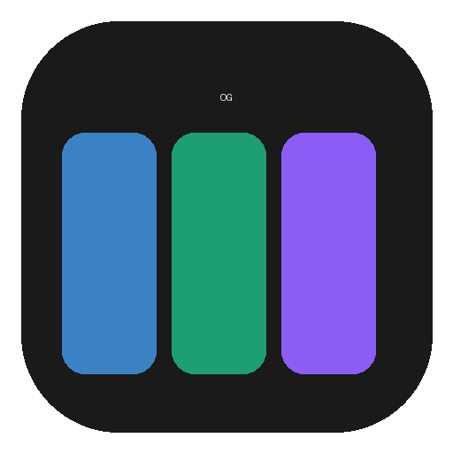

<p align="center">
  
</p>

<h1 align="center">OG TestDesk</h1>

<p align="center">
  A free, open-source desktop dev desk — SQL client, HTTP request client,
  and a shared JSON inspector, in one app, with an AI/MCP hook built in
  from the ground up. Think Postico + Postman + a JSON viewer, unified.
</p>

Built with Tauri (Rust core + native webview) and Svelte. Color-coded
navigation — SQL blue, Requests green, Inspector violet — so it's
always obvious which tool, connection, and tab you're looking at.

## Why this exists

Most people juggle a SQL client, an HTTP client, and a JSON viewer as
three separate paid tools that don't talk to each other. OG TestDesk is
all three in one place, genuinely free (Apache 2.0, no paywall, no
seat licenses), and — its actual headline feature — a local MCP server
so an AI assistant can open tabs, run queries, send requests, and watch
its own results land live in the UI, correcting course as it goes,
instead of you copy-pasting between a terminal and a browser.

## AI / MCP integration

Point Claude, ChatGPT, or any MCP-capable client at the app's local
server and it can, within limits you control per-connection and
server-wide:

- List schemas/columns, run queries, browse foreign keys
- Send HTTP requests, run saved requests
- Open a SQL or request tab, save a query/request/connection — so you
  see exactly what it did, live, in the app itself
- Read the app's own debug state and error log to help diagnose issues

Every capability is behind an explicit flag (`allow_write`,
`allow_http`, `allow_populate`, `allow_manage_connections`) and a
per-connection "exposed" toggle — nothing is reachable by default.
Supports both a static bearer token (for `claude mcp add` / local
config) and a full OAuth 2.0 layer (discovery, dynamic client
registration, PKCE) for clients like ChatGPT's connector framework that
require it.

## SQL

- Connection manager: Postgres, MySQL, SQLite, with per-connection
  accent colors, a **read-only** switch (blocks every write at the
  driver level, everywhere — the editor, MCP, the scheduler), an
  optional SSH tunnel (shells out to the system `ssh`), and a
  pre-connect shell command for IAM-style short-lived credentials
  (`aws rds generate-db-auth-token`, etc.)
- Paste a `postgres://`/`mysql://`/`sqlite://` connection URL to fill
  the form instead of typing each field
- Lazy schema/column tree, foreign-key browser, functions/procedures tab
- CodeMirror editor: run / run-selection, save, schema-aware
  autocomplete, a formatter (per-dialect), history cycling
  (Alt+↑/↓, like a shell), and **Run All** — splits a script on `;`
  (respecting strings/comments) and runs each statement in sequence
  with its own result tab
- Sortable, filterable, virtualized-scroll result grid; CSV/TSV/JSON
  export
- **Real row editing** — edit cells on a plain `SELECT * FROM table`
  (any table with a primary key) and save as actual UPDATE/INSERT/
  DELETE statements, with a confirmation preview before anything runs
- Graphical table structure editor (add/rename/drop columns, change
  type/nullable/default) and a DDL view, both dialect-aware
- CSV import wizard — new table (with inferred column types) or an
  existing one
- Foreign-key picker — jump straight to a referenced row
- Query history and scheduled queries (run on an interval, unattended)

## Requests

- Collections, saved requests, `{{variable}}` environments with an
  active-env switcher, Postman collection import/export
- **Body types**: raw (JSON/text/XML), x-www-form-urlencoded,
  multipart form-data (including file uploads), binary, GraphQL
  (query + variables)
- **Auth**: Bearer, Basic, API key, **OAuth 2.0** (Client Credentials
  and Authorization Code + PKCE, opens your system browser and catches
  the redirect locally), **Digest** (RFC 2617), **AWS Signature v4**
- **Pre-request & test scripts** — a `pm.*` sandbox (environment/global
  variables, a mutable request object, `pm.test(...)` assertions
  against the response) running in a script-sandboxed iframe, not the
  main app
- Cookie manager — a real jar, collected from responses and replayed
  automatically, viewable/editable
- Response viewer with a **visualizer** tab for HTML/image/PDF
  responses, not just raw text
- **Code snippet generation** — cURL, Python, JavaScript, Node.js
- Proxy / custom CA / per-host client certificates (mTLS)
- A local **mock server** — canned status/headers/body per route,
  start/stop on demand
- **WebSocket** connection tester — connect, send, watch a live message
  log
- **gRPC** — server-reflection-based service/method discovery and
  unary calls, no `.proto` file needed if the server supports
  reflection

## Inspector

Tree / Table / Summary views over any JSON — fed automatically from
SQL results and HTTP responses, or paste your own. Search with match
count and auto-expand, a detail panel (path / type / size / pretty +
copy), and per-node editing.

## Project layout

```
core/         og_testdesk_core — persistence (SQLite via sqlx), DB driver
              abstraction (Postgres/MySQL/SQLite), HTTP request runner,
              gRPC reflection client, cookie jar, OS keychain secrets.
              No UI code.
src-tauri/    Tauri backend — command layer wrapping core/, the MCP
              server, the local mock server, window config, packaging.
frontend/     SvelteKit UI — SQL / Requests / Inspector modules, the
              color-coded top nav, shared JSON tree viewer.
```

## Running from source

Requires Rust, Node 20+, and `pnpm`.

```
cd frontend && pnpm install && cd ..
cargo tauri dev
```

(`cargo tauri` requires `cargo install tauri-cli --version "^2"` once.)

The app stores its local metadata SQLite DB in the OS app-data
directory (`OGTestDesk/og_testdesk.db`); override with
`OGTESTDESK_DB_PATH`. Connection passwords are never written to that
file — they live in the OS keychain (macOS Keychain / Windows
Credential Manager / Linux Secret Service), keyed by connection id.

## Building a release

```
cd frontend && pnpm build && cd ..
cargo tauri build
```

## Versioning

One version, in one place: the workspace `Cargo.toml`'s
`[workspace.package] version` — `src-tauri`/`core` inherit it via
`version.workspace = true`, and `tauri.conf.json` has no `version` of
its own, so Tauri reads it from `src-tauri`'s Cargo.toml too.

```
scripts/bump-version.sh 0.2.0     # updates Cargo.toml + frontend/package.json
git add -A && git commit -m "Bump version to 0.2.0"
git tag v0.2.0 && git push origin main v0.2.0
```

Pushing a `v*` tag triggers `.github/workflows/release.yml`, which
builds and packages the app for macOS, Windows, and Linux and attaches
the installers to a (draft) GitHub Release. See `CHANGELOG.md`.

Post-MVP polish and known gaps are tracked in `docs/next-steps.md`.

## License

[Apache License 2.0](LICENSE) — genuinely open source, free for
anyone, personal or commercial, no strings attached.

## Support the project

If OG TestDesk has replaced Postman, Postico, pgAdmin, or a handful of
troubleshooting tools in your day-to-day — especially if that's at a
company where this now sits in the toolchain — consider
[sponsoring](https://github.com/sponsors/OmegaGiven) its development.
Nothing is gated behind it; it's just the most direct way to help keep
this maintained and moving.
